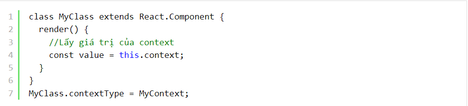
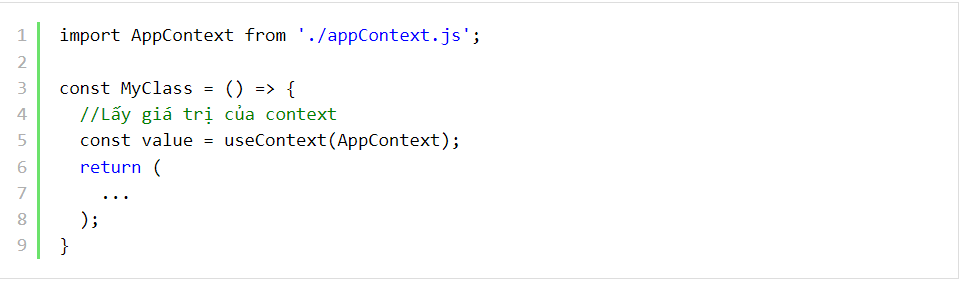
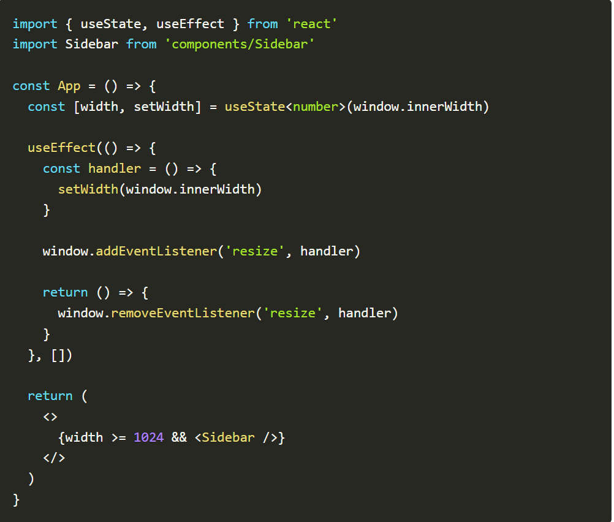
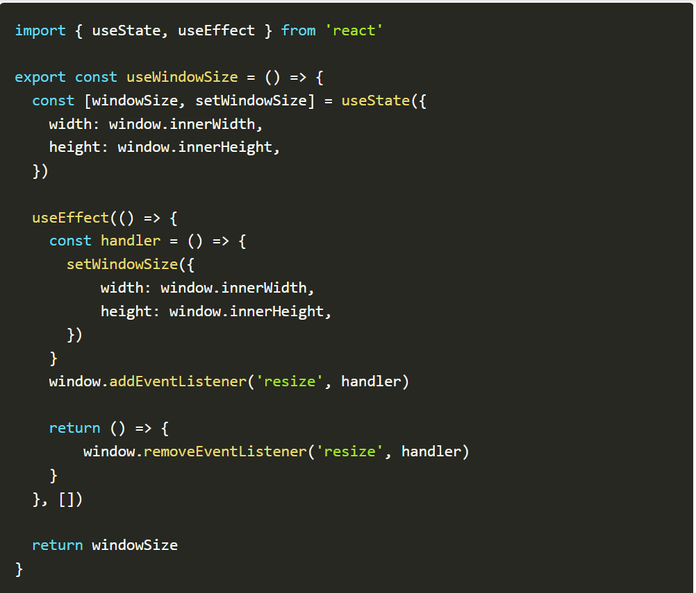
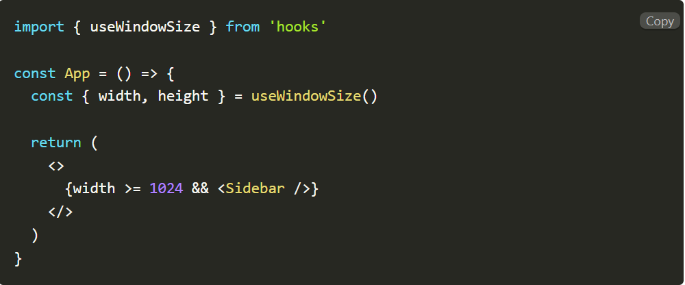

## 1) Pessimistic lock

Pessimistic concurrency control hay pessimistic lock đều diễn tả về cơ chế giải quyết xung đột khi có nhiều transaction cùng thay đổi dữ liệu trên một hoặc một tập các records.

Ví dụ như sau:

Rùa và Thỏ cùng chạy đua xem ai lấy được viên kim cương trước được đặt trong khu đền bí mật. Gấu là người canh gác khu đền, hắn sẽ cung cấp một thẻ bài duy nhất cho người đến trước. Người đến sau phải chờ cho đến khi người trước hoàn thành.

Nếu trò chơi có thêm Ngựa, Sói, Hổ... thì khả năng tắc nghẽn như đường Đào Tấn sáng thứ hai là khó tránh khỏi. Ai chậm chân chắc kịp mắc màn ngủ một giấc mới đến lượt 😴.

Pessimistic lock hoạt động tương tự như trò chơi trên. Khi transaction T(1) start và modify data, nó sẽ thực hiện lock row, page hoặc table tùy thuộc vào điều kiện query. Các transaction T(x) sau không thể modify data trên row đó mà bắt buộc phải chờ cho đến khi T(1) hoàn thành.

Nhược điểm của pessimistic lock là toàn bộ các transaction sau phải chờ cho đến khi transaction trước đó hoàn thành. Nếu chưa hoàn thành thì.. tiếp tục chờ đợi.

Tuy nhiên, nhược điểm trên cũng chính là ưu điểm của pessimistic lock. Do chỉ có duy nhất một transaction thực hiện write nên sẽ tránh conflict data với các transaction còn lại.

Cơ chế sử dụng pessimistic lock bao gồm 3 phase:

- Xác định loại lock cần sử dụng: exclusive lock, shared lock...
- Xây dựng cơ chế quản lý lock.
- Xác định quy trình sử dụng lock cho các transaction.

Với pessimistic lock, về cơ bản toàn bộ quá trình update diễn ra như sau:

- Acquire lock.
- Update data.
- Release lock.

Hãy tưởng tượng quá trình update data diễn ra rất lâu, hoặc trước khi release lock lại thực hiện một load read data khác lâu không kém thì các transaction khác nếu update cùng data phải chờ mốc mỏ mới được thực thi. Thậm chí còn dẫn đến deadlock nếu transaction update data không release lock.

## 2) Optimistic lock

Ta thấy nhược điểm rất lớn của pessimistic lock liên quan đến vấn đề chờ đợi.. một khi đã chờ đợt thì rất bực mình. Thà là cho vào.. ngắm cái rồi đuổi về cũng được, đằng này cứ bắt chờ.

Optimistic lock linh hoạt hơn pessimistic lock, cho phép tất cả được vào nhưng.. chỉ có một con duy nhất chui vào trứng thành công 😂.

Đọc qua ví dụ sau nhé:

Vẫn là cuộc đua giữa Rùa và Thỏ và bác Gấu là người canh giữ ngôi đền bí mật. Thỏ nhanh chân hơn đến trước, bác Gấu phát cho Thỏ tấm thẻ chữ X để vào ngôi đền. Rùa chậm hơn đến sau nhưng cũng được phát cho tấm thẻ tương tự vào trong. Do Thỏ mải chơi ngắm nghía nên quên nhiệm vụ chính. Rùa mặc dù đến sau nhưng tập trung tìm kim cương nên lấy được trước. Rùa ra khỏi cửa trả cho bác Gấu tấm thẻ X, bác Gấu kiểm tra với tủ khóa hiện tại và chưa có ai trả khóa X cả. Bác gấu sau đó cập nhật khóa X lên Y và cho phép Rùa ra khỏi ngôi đền. Thỏ mải chơi ra sau trả thẻ cho bác Gấu. Lúc này khóa mới là Y, không khớp với thẻ của Thỏ. Bác Gấu phát mới cho Thỏ thẻ Y để làm lại nhiệm vụ nếu muốn tiếp tục cuộc chơi.

Lúc này, người đến ngôi đền trước chưa chắc đã là người chiến thắng. Kẻ chiến thắng là người lấy được viên kim cương và ra khỏi ngôi đền đầu tiên.

Cách hoạt động của optimistic lock tương tự với ví dụ trên. Thay vì lock row trong quá trình update như pessimistic lock, optimistic lock chỉ lock khi commit việc update.

Cơ chế update data với optimistic lock diễn ra như sau:

- Fetch data kèm theo version hiện tại. Tất cả các transaction đều có thể fetch data mà không lo ngại vấn đề blocking.
- Update data, đồng thời thêm một version mới.
- Commit transaction. Bây giờ mới là lúc acquire lock. Bác Gấu kiểm tra version cũ của record đó có trùng với version hiện tại mà bác Gấu biết không. Nếu đúng thì cho phép update, đồng thời cập nhật version mới của data. Sau đó release lock. Nếu sai version thì.. tất nhiên rồi, lệnh update không thành công.

Hóa ra vẫn là lock, chỉ là chuyển từ vị trí này sang vị trí khác mà thôi 😂. Tuy nhiên việc chuyển dịch đó cũng là ưu điểm to lớn mà optimistic lock đem lại. At least, cost cho blocking đã giảm kha khá. Optimisic lock sẽ block để compare version nên diễn ra rất nhanh, thay vì block toàn bộ row/table để chờ quá trình update hoàn thành.

Pessimistic lock khá đơn giản để implement, chỉ cần thực hiện lock row/set of row/table là ok. Tuy nhiên với optimistic lock sẽ phức tạp hơn, không hẳn là phức tạp mà là có nhiều cách để implement dựa trên việc quản lý version của record:

- Time-based update detection: dựa trên giá trị time update của column để xác định version của data.
- Implicit hidden column: tạo một column mới do database quản lý để lưu version.

## 3) useContext là gì

useContext là một hooks trong React Hooks cho phép chúng ta có thể làm việc với React Context trong một functional component. Giả sử khi chúng ta muốn lấy giá trị của context trong class component:

Bạn cũng có thể lấy giá trị của context trong funcational componetn bằng cách sử dụng useContext.

Để sử dụng useContext chúng ta sẽ truyền vào hooks này một tham số duy nhất đó là Context Object (được tạo bởi React.createContext).

khi cần lấy giá trị của context trong funtional component chúng ta sẽ sử dụng:

## 4) Custom hook là gì

Custom hooks là việc các bạn tự tạo ra một hook mới với chức năng riêng biệt của nó. Việc này giúp tách phần code logic ra khỏi UI giúp code tường minh, dễ quản lý hơn, tránh lặp lại code và tái sử dụng.

Ví dụ khi bạn không dùng custom hook:

Xây dựng custom hooks :

Cùng tạo tạo ra hook useWindowSize để giải quyết vấn đề trên nào.

Và đây là thành quả của chúng ta, bạn có thể sử dụng hook useWindowSize ở bất kì component nào.

